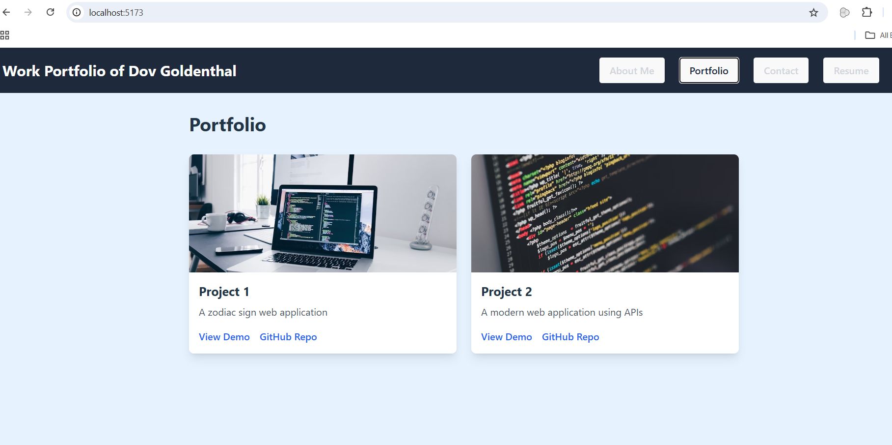

# React Work Portfolio

## Description

A modern, responsive portfolio website built with React and Tailwind CSS, showcasing my web development projects and skills. 
The portfolio features a clean, professional design with sections for About Me, Portfolio, Contact, and Resume.

## Features

- **Responsive Design**: Mobile-first approach ensuring compatibility across all devices
- **Interactive Navigation**: Smooth transitions between different sections
- **Portfolio Showcase**: Display of web development projects with links to live demos and GitHub repositories
- **Contact Form**: Interactive form with email validation and user feedback
- **Downloadable Resume**: Easy access to professional resume and skills
- **Color-Coded Sections**: Distinct background colors for each section enhancing user experience
  - About Me: Light Purple
  - Portfolio: Light Blue
  - Contact: Light Green
  - Resume: Light Orange

## Technologies Used

- React.js
- Tailwind CSS
- Vite (Build Tool)
- HTML5
- CSS3
- JavaScript

## Installation

1. Clone the repository

```bash
git clone git@github.com/dgoldenthal/React-Work-Portfolio.git
```

2. Navigate to the project directory

```bash
cd React-Work-Portfolio
```

3. Install dependencies

```bash
npm install
```

4. Start the development server

```bash
npm run dev
```

5. Build for production

```bash
npm run build
```

## Usage

The portfolio website consists of four main sections:

### About Me

- Brief introduction and background
- Professional summary

### Portfolio

- Showcase of completed projects
- Links to live deployments and GitHub repositories
- Project descriptions and technologies used

### Contact

- Contact form with validation
- Direct email capability
- Error handling and success messages

### Resume

- Downloadable resume
- List of technical skills
- Frontend and backend proficiencies

## Project Structure

```
React-Work-Portfolio/
├── src/
│   ├── components/
│   │   ├── Header.jsx
│   │   ├── Navigation.jsx
│   │   ├── Project.jsx
│   │   └── Footer.jsx
│   ├── pages/
│   │   ├── About.jsx
│   │   ├── Portfolio.jsx
│   │   ├── Contact.jsx
│   │   └── Resume.jsx
│   └── App.jsx
├── public/
│   └── assets/
├── index.html
└── README.md
```

## Contributing

This is a personal portfolio project, but if you have suggestions for improvements, feel free to:

1. Fork the repository
2. Create a new branch
3. Submit a pull request

## License

MIT License - See LICENSE file for details

## Contact

- Portfolio: [Your Portfolio URL]
- GitHub: [https://github.com/dgoldenthal/React-Work-Portfolio]
- Email: [dgoldenthal@gmail.com]

## Screenshots



## Deployment

The application is deployed using [Your Deployment Platform]. You can view the live site at [Your Deployed URL].
